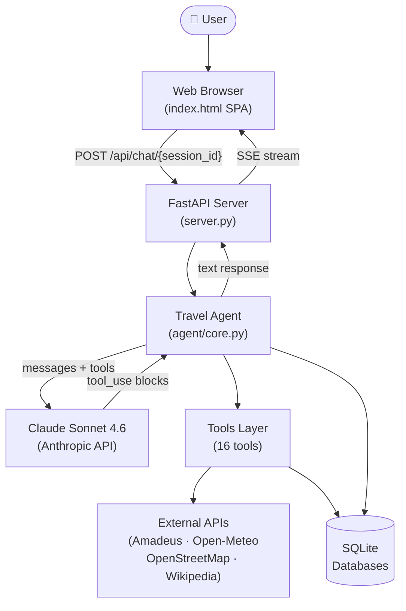
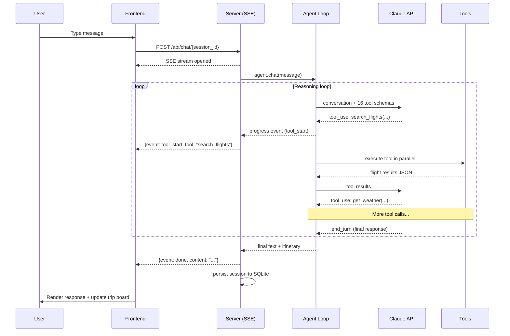
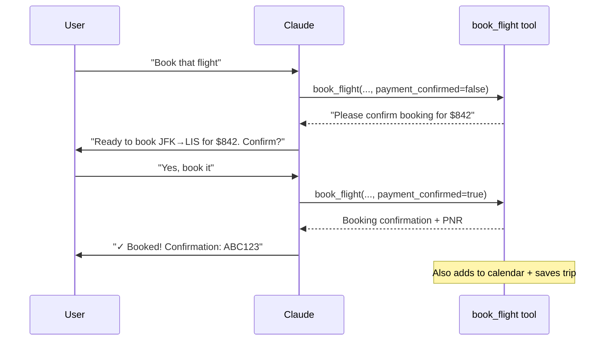
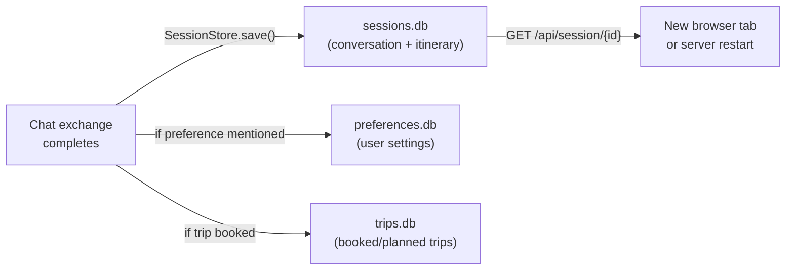

# Travel Agent

A full-stack AI travel planning application powered by Claude. Plans trips, hunts for deals, searches real flights and hotels, checks live weather, builds drag-and-drop itineraries, and books on your behalf — from a rich web UI or the terminal.

```
┌─────────────────────────────────────────────────────────┐
│  "Plan a 5-day trip to Lisbon in May, budget $3000"     │
│                           ↓                             │
│  Claude searches flights, hotels, weather, maps, and    │
│  builds a day-by-day itinerary — streamed live to you   │
└─────────────────────────────────────────────────────────┘
```

## Quick Start

**Web UI (recommended)**

```bash
pip install -r requirements.txt
cp .env.example .env          # add your ANTHROPIC_API_KEY
uvicorn server:app --reload   # open http://localhost:8000
```

**Terminal**

```bash
pip install -r requirements.txt
cp .env.example .env
python cli.py                 # interactive chat in the terminal
```

## Features

| Feature | Description |
|---|---|
| **Natural language trip planning** | Describe your trip in plain English |
| **Flight search & booking** | Real Amadeus API with mock fallback |
| **Hotel search & booking** | Real Amadeus + OpenStreetMap data |
| **Live weather forecasts** | Open-Meteo (free, no key needed) |
| **Deal hunting** | Scan ±N days or 12 months for cheapest flights |
| **Season awareness** | 80+ destinations with peak/shoulder/off-season data |
| **Places & distances** | OpenStreetMap POI search and routing |
| **Persistent sessions** | Conversations and itineraries survive server restarts |
| **Drag-and-drop itinerary** | Rearrange trip days and activities visually |
| **Memory** | Remembers your airline, seat preference, budget, etc. |
| **Real-time streaming** | Tool progress and itinerary updates via SSE |
| **Booking confirmation** | Never books without your explicit approval |

## Architecture Overview



## How the Agent Works

The agent runs a **reasoning loop** — Claude decides what tools to call, the backend executes them, and results feed back to Claude until it has enough information to respond.



## Project Structure

```
travel_agent/
├── server.py              # FastAPI app — SSE streaming, sessions, rate limiting
├── cli.py                 # Rich terminal UI with booking confirmation prompts
│
├── agent/
│   ├── core.py            # Agentic loop: Claude ↔ tools ↔ user
│   └── tools_schema.py    # 16 tool definitions Claude uses to reason
│
├── tools/
│   ├── flights.py         # Flight search & booking (Amadeus + mock fallback)
│   ├── hotels.py          # Hotel search & booking (Amadeus + OSM fallback)
│   ├── weather.py         # Weather forecasts (Open-Meteo, free)
│   ├── maps.py            # POI search & distances (OpenStreetMap)
│   ├── search.py          # Web research (Wikipedia + optional Brave Search)
│   ├── seasons.py         # Season database for 80+ destinations
│   └── calendar.py        # Availability & calendar events
│
├── memory/
│   ├── preferences.py     # User preferences (airlines, budget, seat, etc.)
│   ├── trips.py           # Trip history store
│   ├── sessions.py        # Per-session conversation + itinerary persistence
│   └── _data_dir.py       # Data directory resolution (local / Railway volume)
│
├── static/
│   └── index.html         # Single-file SPA (HTML + CSS + JS, ~2000 lines)
│
├── .env.example           # Environment variable template
├── requirements.txt
├── Procfile               # Railway / Heroku deployment
└── railway.json           # Railway.app config
```

## Configuration

Copy `.env.example` to `.env` and configure:

```bash
# Required
ANTHROPIC_API_KEY=sk-ant-...

# Optional — real flight & hotel data (Amadeus sandbox is free)
AMADEUS_CLIENT_ID=...
AMADEUS_CLIENT_SECRET=...
AMADEUS_HOST=https://test.api.amadeus.com   # default: test sandbox

# Optional — richer web search
BRAVE_SEARCH_API_KEY=...

# Optional — custom data directory (useful for Railway volumes)
TRAVEL_AGENT_DATA_DIR=/data
```

**The only required key is `ANTHROPIC_API_KEY`.** All other integrations have graceful fallbacks.

## External Services

| Service | Keys Required | Used For | Fallback |
|---|---|---|---|
| **Anthropic Claude** | `ANTHROPIC_API_KEY` | AI reasoning (required) | None |
| **Amadeus** | `AMADEUS_CLIENT_ID` + `AMADEUS_CLIENT_SECRET` | Real flight & hotel pricing | Distance-based mock pricing |
| **Open-Meteo** | None (free) | Live weather forecasts | Climate profile estimates |
| **OpenStreetMap** | None (free) | POI search, geocoding, distances | Graceful error |
| **Wikipedia** | None (free) | Travel research / web search | Brave Search fallback |
| **Brave Search** | `BRAVE_SEARCH_API_KEY` | Enhanced web search | Wikipedia |
| **Google Calendar** | *(not yet wired)* | Calendar sync | JSON file mock |

## Tools Available to Claude

Claude has access to 16 tools it can call to fulfil user requests:

| Category | Tools |
|---|---|
| **Flights** | `search_flights`, `book_flight`, `find_cheapest_dates`, `find_cheapest_month` |
| **Hotels** | `search_hotels`, `book_hotel` |
| **Weather & Maps** | `get_weather`, `search_places`, `get_distance` |
| **Calendar** | `check_availability`, `add_to_calendar` |
| **Research** | `web_search` |
| **Memory** | `save_preference`, `get_preferences`, `save_trip`, `get_trips` |
| **UI State** | `update_itinerary` |

## Data Flows

### Booking Confirmation Flow



### Session Persistence Flow



## Deployment

**Railway.app** (one-click deploy):

1. Fork this repo
2. Connect to Railway, add environment variables
3. Add a volume mounted at `/data` and set `TRAVEL_AGENT_DATA_DIR=/data`
4. Deploy — Railway uses `Procfile` automatically

**Docker / any host**:

```bash
pip install -r requirements.txt
uvicorn server:app --host 0.0.0.0 --port 8000
```

## CLI Reference

| Command | Description |
|---|---|
| `python cli.py` | Start the travel agent |
| `python cli.py --setup` | Interactive preference setup wizard |
| `python cli.py --trips` | View all saved trips |
| `python cli.py --prefs` | View your saved preferences |
| `reset` (in chat) | Start a new conversation |
| `trips` (in chat) | List saved trips |
| `quit` (in chat) | Exit |

## Example Conversations

```
You: Plan a 5-day trip to Lisbon in May for 2 people, budget around $3000

You: Find cheapest flights from New York to Tokyo — I'm flexible on dates

You: What's the best time to visit Bali? I hate crowds.

You: Book the second hotel option you showed me

You: I always fly Delta and prefer window seats — remember that for next time

You: Show me restaurants and things to do near our hotel in Paris
```

## Security

- **Rate limiting**: 20 requests/minute per IP on `/api/chat`
- **Security headers**: CSP, X-Frame-Options, X-Content-Type-Options
- **Booking confirmation**: Dual-stage — Claude asks user, user must confirm
- **No secrets in frontend**: API keys are server-side only
- **Input validation**: Pydantic models on all request bodies

## Detailed Documentation

- [Architecture deep-dive](docs/architecture.md) — Component diagrams, data models, and design decisions
