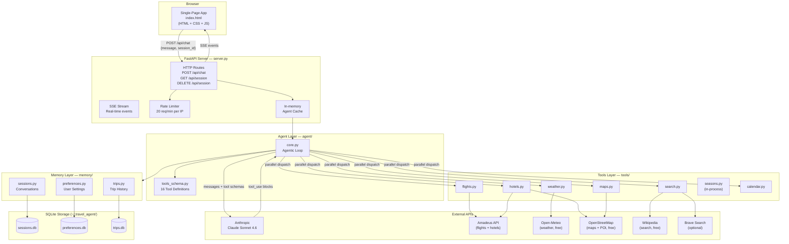
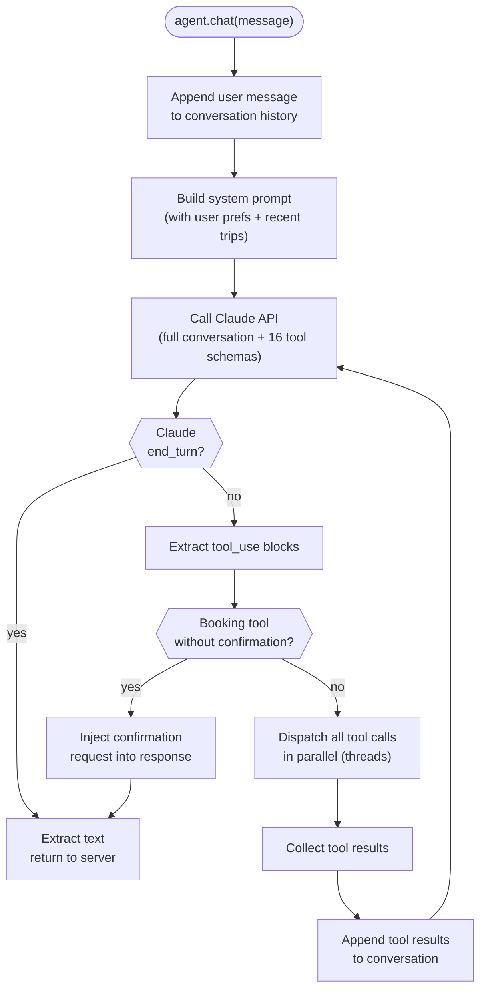
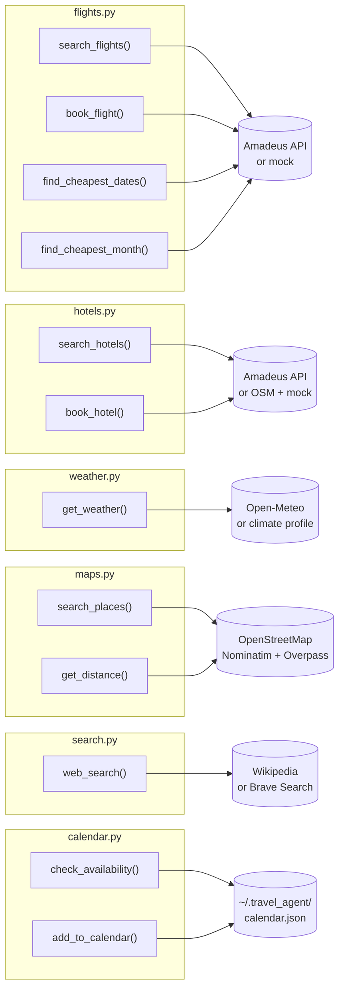
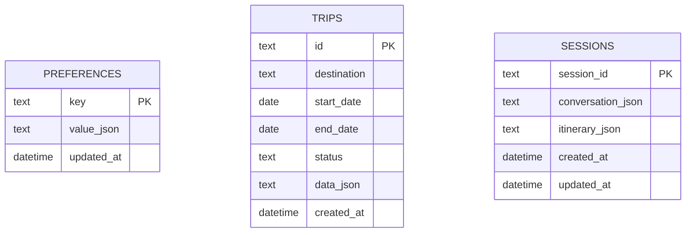
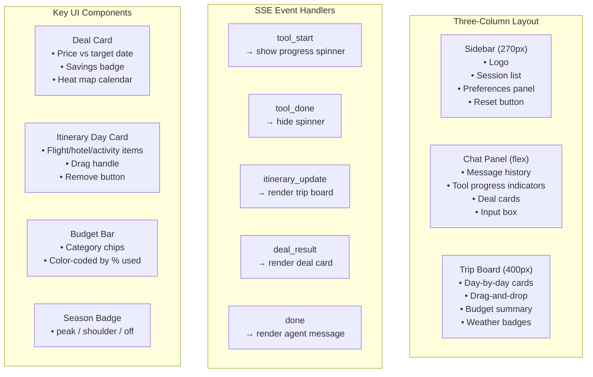
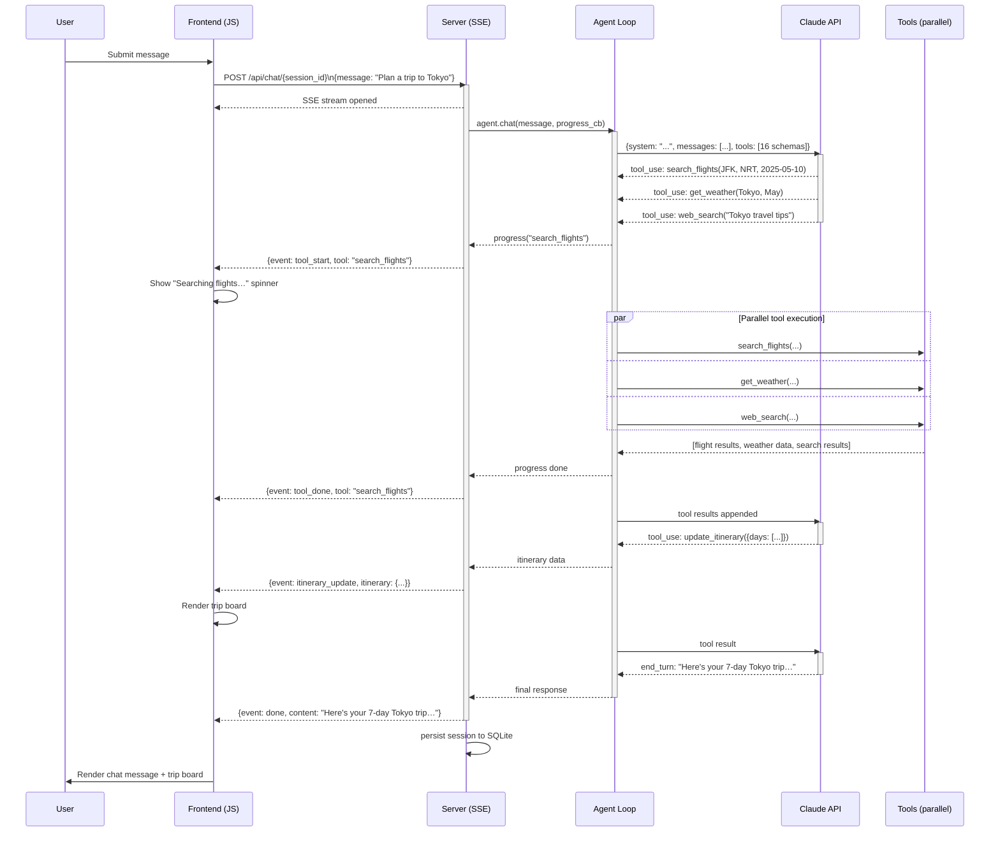
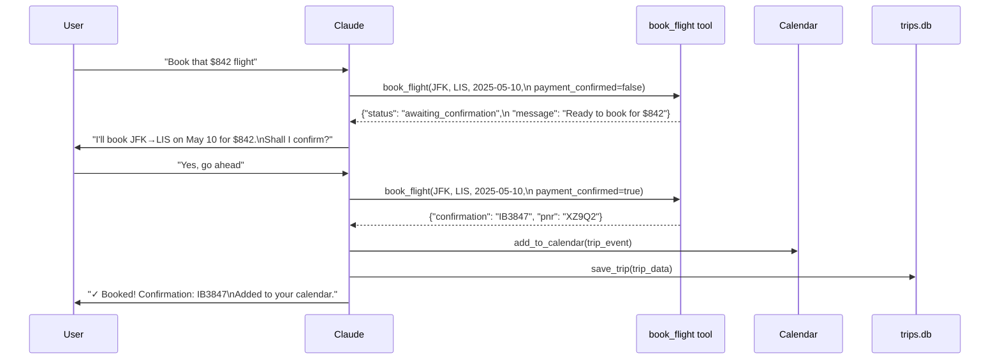
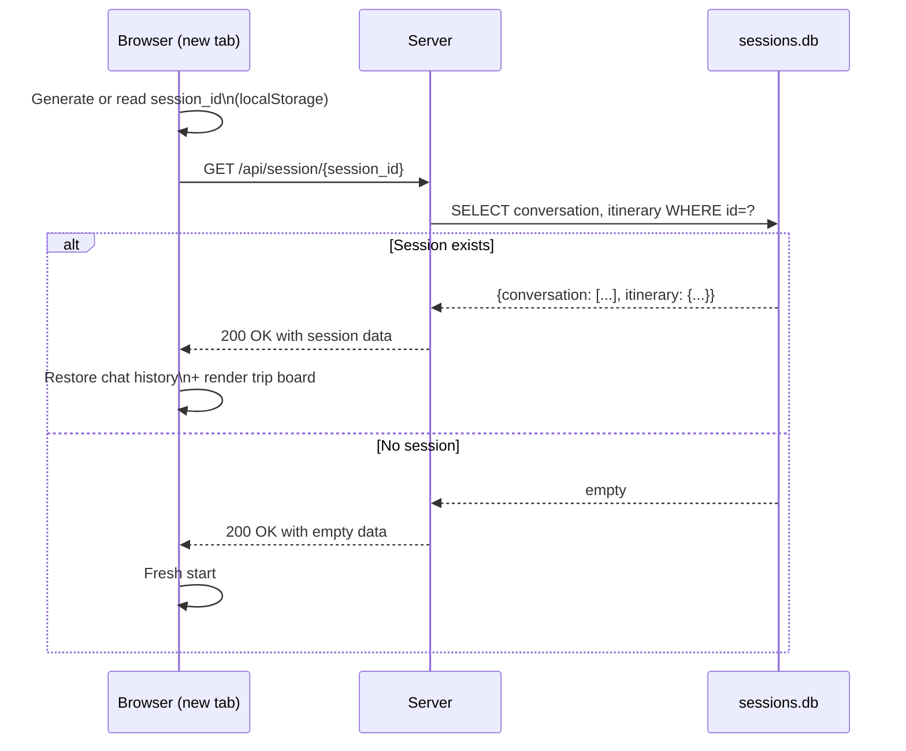
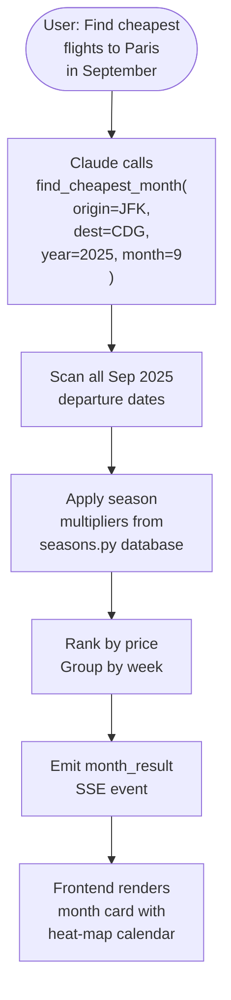
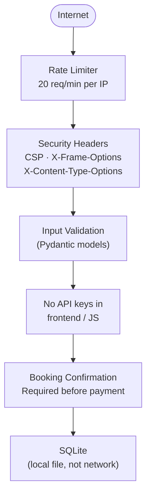

# Architecture Deep-Dive

This document explains how the Travel Agent is built, how its components interact, and the key design decisions behind it.

---

## Table of Contents

- [System Architecture](#system-architecture)
- [Backend Components](#backend-components)
  - [FastAPI Server](#fastapi-server-serverpy)
  - [Agent Core](#agent-core-agentcorepy)
  - [Tools Layer](#tools-layer)
  - [Memory Layer](#memory-layer)
- [Frontend Architecture](#frontend-architecture-staticindexhtml)
- [Data Flows](#data-flows)
  - [Message → Response](#1-message--response-flow)
  - [Booking Confirmation](#2-booking-confirmation-flow)
  - [Session Restore](#3-session-restore-flow)
  - [Deal Hunting](#4-deal-hunting-flow)
- [External APIs](#external-apis)
- [Data Models](#data-models)
- [Security Architecture](#security-architecture)
- [Deployment Architecture](#deployment-architecture)

---

## System Architecture



---

## Backend Components

### FastAPI Server (`server.py`)

The server is the entry point for all web traffic. It manages:

- **Sessions**: Each browser tab gets a UUID `session_id`. The server caches `TravelAgent` instances in memory and restores from SQLite on cache miss.
- **SSE Streaming**: Chat responses are streamed via Server-Sent Events so the UI updates in real-time as tools execute.
- **Rate Limiting**: A sliding window of 20 requests/minute per IP protects against abuse.
- **Persistence**: After each chat exchange, the conversation and current itinerary are written to `sessions.db`.

**Key routes:**

| Method | Path | Description |
|---|---|---|
| `GET` | `/` | Serve `static/index.html` |
| `POST` | `/api/chat/{session_id}` | Send a message; returns SSE stream |
| `GET` | `/api/session/{session_id}` | Restore a session (conversation + itinerary) |
| `DELETE` | `/api/session/{session_id}` | Clear a session (start fresh) |
| `GET` | `/api/sessions` | List all sessions |

**SSE event types emitted during a chat:**

```
tool_start      → { "tool": "search_flights", "label": "Searching flights…" }
tool_done       → { "tool": "search_flights" }
itinerary_update → { "itinerary": { "destination": "…", "days": […] } }
deal_result     → { "deal": { "origin": "…", "results": […] } }
month_result    → { "deal": { "origin": "…", "months": […] } }
error           → { "message": "…" }
done            → { "content": "Final agent response text" }
```

---

### Agent Core (`agent/core.py`)

The `TravelAgent` class runs the **agentic reasoning loop**:



**Key design decisions:**
- **Parallel tool execution**: All tool calls in a single Claude response are dispatched simultaneously using `ThreadPoolExecutor`.
- **Context injection**: User preferences and recent trips are injected into the system prompt on every turn, keeping Claude informed without the user repeating themselves.
- **Conversation history**: The full conversation is sent to Claude each turn (no external memory retrieval needed for short sessions).

---

### Tools Layer

Each tool is a Python module that Claude can call. Tools have two modes:

1. **Real API mode**: Activated when environment variables are set.
2. **Fallback mode**: Uses free public APIs (Open-Meteo, OpenStreetMap, Wikipedia) or mock data.



#### Tool: `find_cheapest_dates` / `find_cheapest_month`

The deal-hunting flagship feature. Scans flight prices across a flexible date window and returns ranked results:

```
find_cheapest_dates(origin, destination, target_date, flexibility_days=7)
  → Scans [target_date - N ... target_date + N]
  → Returns: best_price, savings_vs_target, days_from_target

find_cheapest_month(origin, destination, year, month)
  → Scans all departure dates in the month
  → Groups by week, applies season multipliers
  → Returns: cheapest_week, price_range, season_context
```

#### Tool: `update_itinerary`

A special tool that has no external API side-effect — it simply causes the server to emit an `itinerary_update` SSE event, which the frontend uses to update the visual trip board in real-time.

---

### Memory Layer

Three SQLite-backed stores in `~/.travel_agent/` (or `$TRAVEL_AGENT_DATA_DIR`):



**Preference keys stored by default:**

| Key | Example Value |
|---|---|
| `preferred_airlines` | `["Delta", "United"]` |
| `seat_preference` | `"window"` |
| `budget_per_day` | `200` |
| `home_airport` | `"JFK"` |
| `dietary_restrictions` | `["vegetarian"]` |
| `travel_pace` | `"relaxed"` |
| `accommodation_type` | `"hotel"` |

---

## Frontend Architecture (`static/index.html`)

The entire frontend is a single HTML file (~2000 lines). It uses no build step, no npm, and only one CDN dependency (`marked.js` for Markdown rendering).



**State management** is entirely in plain JavaScript module-level variables:

```javascript
let currentSessionId   // UUID for this browser tab
let currentItinerary   // { destination, days: [...], budget: {...} }
let conversationEl     // DOM reference to chat panel
let activeSseSource    // EventSource for current chat request
```

---

## Data Flows

### 1. Message → Response Flow



---

### 2. Booking Confirmation Flow



---

### 3. Session Restore Flow



---

### 4. Deal Hunting Flow



---

## External APIs

### Amadeus (Flights & Hotels)

- Uses OAuth 2.0 client credentials flow; token is cached until expiry.
- **Test sandbox**: `https://test.api.amadeus.com` (free, limited data)
- **Production**: `https://api.amadeus.com` (requires paid plan)
- Set `AMADEUS_HOST` env var to switch between them.

```
Authentication:
  POST /v1/security/oauth2/token
  → access_token (cached, ~30 min TTL)

Flight search:
  GET /v2/shopping/flight-offers
  → price, segments, carriers, cabin class

Hotel search:
  GET /v3/shopping/hotel-offers
  → properties, rates, amenities
```

### Open-Meteo (Weather)

Free, no API key required. Returns hourly/daily forecasts using WMO weather codes.

```
GET https://api.open-meteo.com/v1/forecast
  ?latitude=38.72&longitude=-9.14
  &daily=temperature_2m_max,precipitation_sum,weathercode
  &forecast_days=7
```

### OpenStreetMap (Maps & POI)

Two free APIs used:

- **Nominatim** — Geocoding (place name → lat/lon)
- **Overpass API** — POI search (restaurants, museums, beaches, etc.) using OSM tag queries

```
Nominatim:
  GET https://nominatim.openstreetmap.org/search
  ?q=Lisbon&format=json&limit=1

Overpass:
  POST https://overpass-api.de/api/interpreter
  [out:json]; node["amenity"="restaurant"](around:2000,38.7,-9.1); out 10;
```

### Wikipedia (Search)

Free REST API, no key needed. Returns article summaries for travel research.

```
GET https://en.wikipedia.org/api/rest_v1/page/summary/{title}
GET https://en.wikipedia.org/w/api.php?action=query&list=search&srsearch={query}
```

---

## Data Models

### Itinerary (sent via `update_itinerary` tool)

```json
{
  "destination": "Lisbon, Portugal",
  "start_date": "2025-05-10",
  "end_date": "2025-05-17",
  "travelers": 2,
  "max_budget_usd": 3000,
  "season": "shoulder",
  "days": [
    {
      "day": 1,
      "date": "2025-05-10",
      "title": "Arrival Day",
      "items": [
        {
          "type": "flight",
          "time": "08:30",
          "title": "JFK → LIS",
          "detail": "TAP Air Portugal · 7h 20m",
          "price_usd": 620
        },
        {
          "type": "hotel",
          "title": "Bairro Alto Hotel",
          "detail": "Check-in · Superior Room",
          "price_usd": 180
        },
        {
          "type": "activity",
          "time": "19:00",
          "title": "Dinner in Alfama",
          "detail": "Traditional fado restaurant",
          "price_usd": 45
        }
      ]
    }
  ],
  "budget_breakdown": {
    "flights": 1240,
    "hotels": 1260,
    "activities": 300,
    "food": 350,
    "transport": 100
  }
}
```

### Deal Card (sent via `deal_result` SSE event)

```json
{
  "origin": "JFK",
  "origin_city": "New York",
  "destination": "CDG",
  "destination_city": "Paris",
  "target_date": "2025-09-15",
  "results_by_price": [
    {
      "date": "2025-09-12",
      "price_usd": 680,
      "days_from_target": -3,
      "savings_usd": 145,
      "savings_pct": 17
    }
  ],
  "heatmap": {
    "2025-09-01": 920,
    "2025-09-02": 880,
    "2025-09-12": 680
  }
}
```

---

## Security Architecture



**Protections in place:**
- Rate limiting prevents API abuse and cost amplification
- CSP blocks XSS by restricting script/style sources
- All API keys are server-side only; the frontend gets only sanitized data
- Booking tools require `payment_confirmed=true`, which Claude only sets after explicit user confirmation
- Pydantic validates all incoming request bodies

---

## Deployment Architecture

### Local Development

```
Developer Machine
├── uvicorn server:app --reload   (port 8000)
├── ~/.travel_agent/
│   ├── sessions.db
│   ├── preferences.db
│   └── trips.db
└── .env  (API keys)
```

### Railway.app Production

```
Railway Project
├── Web Service (Nixpacks from Procfile)
│   └── uvicorn server:app --host 0.0.0.0 --port $PORT
├── Persistent Volume  →  /data
│   ├── sessions.db
│   ├── preferences.db
│   └── trips.db
└── Environment Variables
    ├── ANTHROPIC_API_KEY
    ├── AMADEUS_CLIENT_ID
    ├── AMADEUS_CLIENT_SECRET
    ├── BRAVE_SEARCH_API_KEY
    └── TRAVEL_AGENT_DATA_DIR=/data
```

**`railway.json` config:**
```json
{
  "build": { "builder": "NIXPACKS" },
  "deploy": {
    "restartPolicyType": "ON_FAILURE",
    "restartPolicyMaxRetries": 10
  }
}
```

The `TRAVEL_AGENT_DATA_DIR` environment variable is the key to persistence on Railway — it redirects all SQLite databases to the mounted volume, surviving deployments and restarts.
